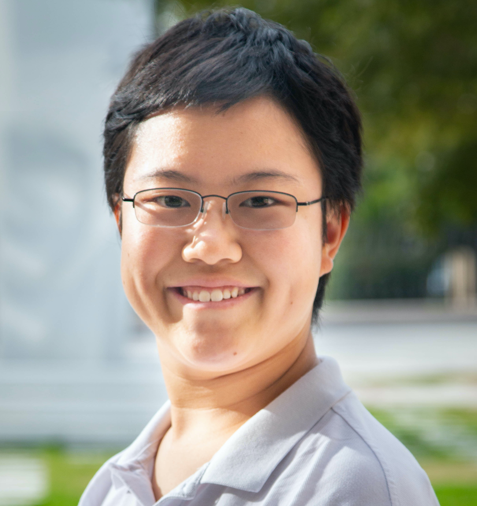

   

# Principal Investigator

***

## Jack Reilly {#reilly}

  

  
  

**Email:** [jreilly@ncf.edu](mailto:jreilly@ncf.edu)  
**Website:** https://jacklreilly.github.io/

Welcome. I am an Associate Professor of Political Science at New College of Florida. I study how the context and communication networks in which individuals are embedded structure their political choices, preferences, and behavior, and teach courses on political behavior, American politics, social networks, and quantitative social science.

   

# Current Lab Members

***
## Jennifer Lin {#lin}

  

**Email:** [jennifer.lin16@ncf.edu](mailto:jennifer.lin16@ncf.eud)  
**Website:** https://lin-jennifer.github.io/

Hi, I am Jennifer

